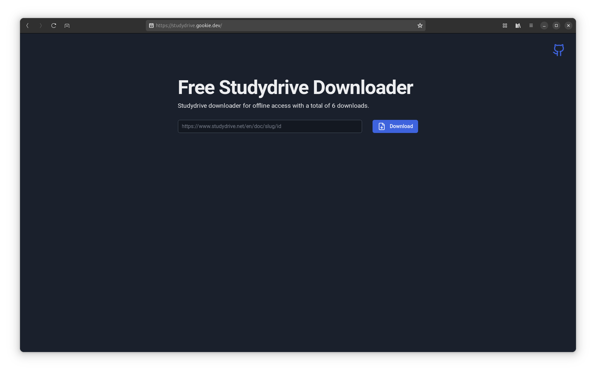
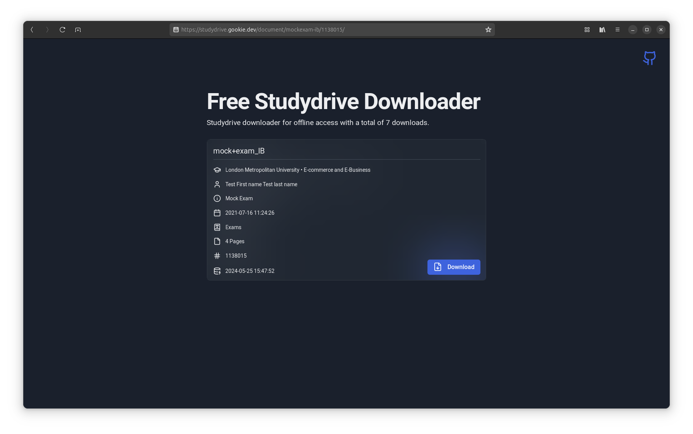

# Studydrive Downloader

Studydrive Downloader is a free tool that allows you to download documents from Studydrive with ease. Simply enter the URL of the document you want to download, and our website will handle the rest.

## Features

- Easy to use: Just enter the URL of the Studydrive document you want to download.
- Fast and efficient: Our website quickly fetches and downloads the document for you.
- Free of charge: No hidden costs or fees.

## Preview

Here are some screenshots of the Studydrive Downloader in action:

## Usage

1. Navigate to the Studydrive document you want to download.
2. Copy the URL of the document.
3. Paste the URL into the input field on the Studydrive Downloader website.
4. Click the "Download" button.
5. The website will fetch and download the document for you.

## Note on `studydrive_downloader.py`

Please be aware that the `studydrive_downloader.py` file is intentionally not included in this repository. This is to prevent the developers of Studydrive from identifying and fixing the exploit that this tool uses to download documents.
